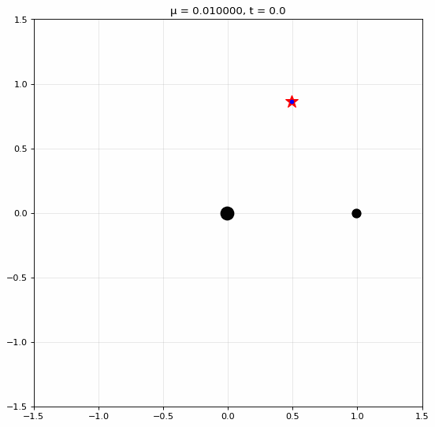
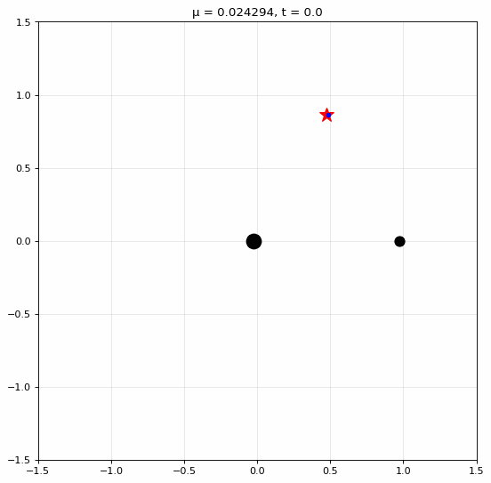

## 📖 О проекте

Данный проект посвящен изучению влияния резонансов на устойчивость положений равновесия, а также моделированию и визуализации движения тела малой массы вблизи точек либрации в случае плоской круговой задачи трех тел

---

## 📚 Постановка задачи

Рассмотрим автономную каноническую систему дифференциальных уравнений

$$
\frac{dq_i}{dt} = \frac{\partial H}{\partial p_i}, \quad \frac{dp_i}{dt} = -\frac{\partial H}{\partial q_i} \qquad (i = 1, 2).
$$

Пусть начало координат является положением равновесия системы и гамильтониан $H$ есть аналитическая функция обобщенных координат и импульсов $q_i$, $p_i$, разлагающаяся в ряд

$$
H = H_2 + H_3 + H_4 + \dots,
$$

где $H_m$ — однородная функция степени $m$ относительно $q_i$, $p_i$.

---

## 🧠 Теорема Арнольда — Мозера

**Теорема.** Если функция Гамильтона такова, что:

1. Характеристическое уравнение линеаризованной системы имеет чисто мнимые корни $\pm i\omega_1$, $\pm i\omega_2$;
2. 
   $$
   n_1\omega_1 + n_2\omega_2 \neq 0,
   $$
   где $n_1$, $n_2$ — целые числа, $0 < |n_1| + |n_2| \leq 4$;
3. 
   $$
   c_{20}\omega_2^2 + c_{11}\omega_1\omega_2 + c_{02}\omega_1^2 \neq 0,
   $$

то положение равновесия устойчиво по Ляпунову.

В формулировке теоремы предполагается, что функция Гамильтона записана в виде

$$
H = \omega_1 r_1 - \omega_2 r_2 + c_{20}r_1^2 + c_{11}r_1r_2 + c_{02}r_2^2 + O((r_1 + r_2)^{5/2}),
$$

где $2r_i = q_i^2 + p_i^2$.

Если $\omega_1 \geq \omega_2 > 0$, то условие 2 не выполняется при $\omega_1 = k\omega_2$ ($k = 1, 2, 3$).

---

## 🔍 Резонансные случаи

### Случай $\omega_1 = 2\omega_2$

Пусть частоты линеаризованной системы связаны резонансным соотношением третьего порядка $\omega_1 = 2\omega_2$. Гамильтониан имеет вид:

$$
H = \frac{1}{2} (p_1^2 + \omega_1^2 q_1^2) - \frac{1}{2} (p_2^2 + \omega_2^2 q_2^2) + \sum_{\nu_1 + \nu_2 + \mu_1 + \mu_2 = 3} h_{\nu_1 \nu_2 \mu_1 \mu_2} q_1^{\nu_1} q_2^{\nu_2} p_1^{\mu_1} p_2^{\mu_2}.
$$

После канонических преобразований и приведения к полярным координатам функция Гамильтона принимает вид:

$$
H = 2\omega_2 r_1 - \omega_2 r_2 - \sqrt{\omega_2 (x_{1002}^2 + y_{1002}^2)} r_2 \sqrt{r_1} \sin(\varphi_1 + 2\varphi_2) + \tilde{H}(r_j, \varphi_j).
$$

**Теорема.** Если $x_{1002}^2 + y_{1002}^2 \neq 0$, то положение равновесия **неустойчиво**. Если же $x_{1002}^2 + y_{1002}^2 = 0$, а $c_{20} + 2c_{11} + 4c_{02} \neq 0$, то имеет место **устойчивость** по Ляпунову.

---

## 🌍 Точки либрации в ограниченной задаче трёх тел

Рассмотрим три материальные точки $m_1$, $m_2$ и $m_3$, движущиеся под действием взаимного гравитационного притяжения. Полагаем $m_1 \gg m_2$, а массу $m_3$ пренебрежимо малой. Это **ограниченная задача трёх тел**.

**Точки либрации** — точки в пространстве, где сумма гравитационных и центробежной сил равна нулю.

Существуют **пять** точек либрации:
- $L_1, L_2, L_3$ — на прямой, проходящей через $m_1$ и $m_2$;
- $L_4, L_5$ — в вершинах равносторонних треугольников.

В **синодической системе координат** (вращающейся вместе с $m_1$ и $m_2$):
- $m_1$ находится в $(-\mu, 0)$;
- $m_2$ находится в $(1 - \mu, 0)$;
- $L_{4,5} = \left( \frac{1}{2} - \mu, \pm \frac{\sqrt{3}}{2} \right)$;

где $\mu = \frac{m_2}{m_1 + m_2}$.

---

## ⚖️ Условие устойчивости в первом приближении

Для круговой ограниченной задачи трёх тел треугольные точки либрации устойчивы в линейном приближении при:

$$
0 < 27\mu(1 - \mu) < 1
$$

---

## 🧪 Результаты: устойчивость и неустойчивость

В области устойчивости в линейном приближении треугольные точки либрации устойчивы по Ляпунову при всех $\mu$, **кроме двух резонансных значений**:

| $\mu$ | Резонанс | Тип |
|-------|----------|-----|
| $\mu_1 = 0.0242938\ldots$ | $\omega_1 = 2\omega_2$ | **Неустойчивость** |
| $\mu_2 = 0.0135160\ldots$ | $\omega_1 = 3\omega_2$ | **Неустойчивость** |

### Пример: $\mu = \mu_1$ ($\omega_1 = 2\omega_2$)

Нормализованная до членов третьего порядка функция Гамильтона имеет вид:

$$
H = \omega_1 r_1 - \omega_2 r_2 + \alpha_1 r_2 \sqrt{r_1} \sin(\varphi_1 + 2\varphi_2) + \beta_1 r_2 \sqrt{r_1} \cos(\varphi_1 + 2\varphi_2) + O((r_1 + r_2)^3),
$$

где $\alpha_1 = 1.322\ldots$, $\beta_1 = 0.298\ldots$. Так как $\alpha_1^2 + \beta_1^2 \neq 0$, имеет место **неустойчивость**.

---

## 🎬 Визуализация

### Устойчивый случай ($\mu = 0.01$)

Частица остаётся вблизи $L_4$:



### Неустойчивый случай ($\mu = 0.0242938$, $\omega_1 = 2\omega_2$)

Частица покидает окрестность $L_4$ по спирали:



### Неустойчивый случай ($\mu = 0.0135160$, $\omega_1 = 3\omega_2$):


---

## 🔧 Установка и запуск

### Компиляция C++ кода

```bash
cd cpp
mkdir build && cd build
cmake ..
cmake --build . --config Release
